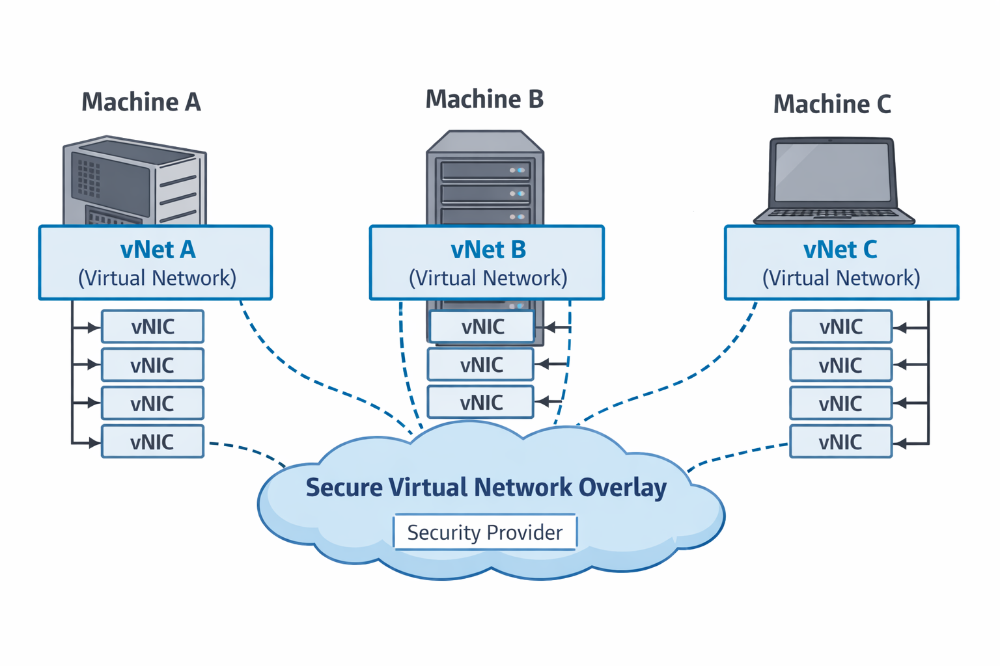

# 
 Networking

## Identify the Missing Infrastructure

In the modern world, every household member carries a cellphone.
They can almost literally call anyone else in the world, and be called by anyone.

At first glance, this seems sufficient.
After all, communication already exists.

But look closer.

Using this infrastructure as is comes with serious limitations:

- Each household member must know every other member’s phone number.

- There is no built-in notion of availability.

- If multiple household members can answer a question, the caller must:
call one → fail → call the next → and so on.

- Any household member can receive spam calls from the entire world.

- When a new household member joins, there is no automatic discovery.

- Calls are not secure by default; with the right technology, they can be intercepted.

- Each household member may use different phone hardware and vendors.

- There are no rules or policies governing who may call whom.

Yes, this infrastructure works, technically.

But every well-run household ends up building additional, proprietary solutions to compensate:
contact lists, group chats, call screening, messaging apps, access rules, and encryption overlays.

---
## Why OSI Layer 7 Is Insufficient for Modern Systems

**OSI Layer 7** was designed for the monolithic software era.

It assumes:

- Bounded applications
- Stable endpoints
- Explicit APIs
- Known request/response paths
- Human-designed integration points

In that world, application logic was the correct abstraction boundary.

Modern systems are no longer applications. They are distributed collections of independently deployed, 
independently owned processes.

**OSI Layer 7** answers the question:

***"How does one application speak to another?"***

Modern systems require answers to a different class of questions:

- Who is allowed to communicate with whom?
- How is identity established when instances are ephemeral?
- How is availability determined dynamically?
- How is intent expressed instead of hard-coded routing?
- How are failures isolated instead of propagated?

**These questions are architectural, not protocol-level.**

The OSI model ends at Layer 7 because architecture was historically implicit and embedded inside 
applications. That assumption **no longer holds in distributed systems.**

Layer 7 provides syntax. It does not provide intent.

It defines how messages are formatted, but not why communication should occur, under what authority,
or what happens when assumptions fail.

This gap forces modern systems to compensate by embedding architecture into:

- libraries
- frameworks
- configuration files
- sidecars
- retries
- conventions
- tribal knowledge

**This is the root of implicit architecture.**

The OSI model did not fail. It ended when application architecture was still assumed to be implicit, 
an assumption that no longer holds in the distributed systems era.

---
## Filling the Missing Infrastructure
In the household analogy, Layer 8 introduces a special cellphone case.

When a household member enters the house, they place their cellphone inside this case.
The phone remains the same, but the environment around it changes.

The case adds the following capabilities:

- All communication between household members is isolated from the outside world.

- Members can see the availability and status of other members before calling.

- Questions can be raised by subject, and one of the qualified household members will respond.

- New members joining, or members leaving, are automatically discovered and updated.

- All calls between household members are secured by default.

- Security officers define who may communicate with whom and what information may be shared.

From the household’s perspective, communication becomes simple, safe, and predictable.

In the networking world, achieving this behavior today requires a fragile combination of:

- micro-segmentation
- VPNs
- AAA systems
- service discovery
- messaging infrastructure

Maintaining this at scale is operationally expensive and architecturally brittle.

Layer 8 takes a different approach.

Instead of layering multiple systems together, it introduces a single construct:
the **Secure Virtual Network Overlay.**

This overlay provides isolation, discovery, security, policy enforcement, and intent-based communication 
as one coherent layer, without leaking complexity to the applications.

---
## Secure Virtual Network Overlay

The same pattern repeats in distributed systems.

We rely on raw networking primitives, IP addresses, ports, routes;
and then spend enormous effort **rebuilding** everything modern systems actually need:

- discovery
- availability
- routing logic
- security
- policy enforcement
- abstraction

This is not accidental. It is a structural gap.

The OSI networking model ends at Layer 7.
It describes how machines communicate, **not how processes coordinate in a distributed world.**

Modern systems are process-to-process. Not host-to-host.

Layer 8 exists to fill this missing layer.

The Secure Virtual Network Overlay provides what basic networking never did:

- intent-driven communication
- built-in security
- policy-aware routing
- abstraction from physical topology

Participants do not need to know IPs, ports, locations, or instances.
They only express intent, **who they want to talk to and why.**

The overlay resolves the rest.

Layer 8 is not an extension of the OSI model. It is the missing layer above it.

A process-to-process networking layer, designed for modern distributed systems.

### How Discovery, Routing, and Security Collapse into One Layer

In traditional systems, discovery, routing, and security are implemented as separate concerns:

- Service discovery systems decide *where* a service lives
- Routing logic decides *how* to reach it
- Security systems decide *whether* communication is allowed

Because these systems are separate, they drift.
They fail independently.
And applications are forced to compensate.

Layer 8 collapses these concerns by making **identity and intent the primary abstraction**.

When a vNIC connects to the Secure Virtual Network Overlay, it does not advertise an address.
It advertises **who it is** and **what it is allowed to do**.

From that moment:

- **Discovery** becomes implicit: services are visible by identity and capability, not location
- **Routing** becomes policy-driven: messages are delivered based on intent, not topology
- **Security** becomes inherent: communication is permitted or denied before routing occurs

There is no phase where a service is discovered but not authorized.
There is no route that exists but should not be used.
There is no packet that must be inspected after it has already arrived.

These concerns collapse because they share the same decision point.

The overlay resolves discovery, authorization, and delivery as a **single operation**.

By the time a message is routed, it has already been authenticated, authorized, and scoped.
By the time a service is visible, it is already permitted.

This is not optimization. It is elimination.

Layer 8 removes entire classes of failure by ensuring that discovery, routing, and security cannot diverge.

They are no longer separate systems that must agree.
They are a **single architectural authority.**

### Concrete Anti-Pattern Replaced: Service Mesh Sprawl

A common response to the limitations of OSI Layer 7 in distributed systems is the **service mesh**.

Service meshes attempt to recover missing architectural guarantees by introducing:

- sidecar proxies per service instance
- out-of-band service discovery
- distributed routing rules
- duplicated security and policy engines

Over time, this leads to **service mesh sprawl**:

- every service runs additional infrastructure code
- routing logic is split between application, proxy, and control plane
- security decisions occur *after* traffic is already flowing
- failures emerge from coordination gaps between layers

In effect, the mesh reconstructs Layer 8, but implicitly, indirectly, and repeatedly.

Layer 8 replaces service mesh sprawl by making those concerns **explicit and singular**.

Instead of:

- embedding networking logic into sidecars,
- duplicating policy engines across the fleet, and
- coordinating multiple control planes,

Layer 8 provides one architectural authority where:

- discovery is identity-based,
- routing is intent-driven, and
- security is enforced before communication occurs.

The result is not a thinner mesh.
It is the **removal of the mesh entirely**.

---
## One Small Concept Change, Giant Leap for Simplicity

Every distributed system begins with the same set of questions:

- How does my service communicate with the outside world?

- What IP does it use?

- What port?

- How is redundancy handled?

- Who provides this information?

- What is the API?

- What is the protocol?

And many more.

These questions are so familiar that we rarely challenge them.

The small conceptual shift is simple:

**Why should I care?**

In hardware, the Network Interface Card (NIC) connects a computer to the network.
You do not design a new NIC for every machine you build.
You buy one and plug it in.

Today, the NIC is built directly into the motherboard, a commodity.

**In software, we do the opposite.**

For every project, for every system, for every team, we rebuild process-to-process communication:
addressing, routing, discovery, retries, security, policy, and failure handling.

Again.
And again.
And again.

Sarcastically speaking: we get it right every time.

**Layer 8 stops this.**

Instead of rebuilding communication per project, Layer 8 encapsulates it into a single component:
the **Virtual Network Interface**, or vNIC.

The vNIC abstracts modern software communication behind a single, consistent interface.
Applications do not deal with IPs, ports, protocols, or topology.
They simply communicate.

While Layer 8 provides its own vNIC implementation, reinforced with AI, it fully embraces Rule #1:
**someone else can do it better.**

For that reason, the vNIC is fully interfaced and agnostic.
Anyone can implement it differently, improve it, or replace it entirely; 
without changing the system design.

This is the shift:
communication is no longer reinvented. It is plugged in.

---
## But How Does It Work?

### Diagram Legend — What Each Component Removes

**vNIC (Virtual Network Interface)**  
Removes:
- IP and port awareness from application code
- Hard-coded service endpoints
- Application-embedded retry, routing, and security logic

**vNet (Virtual Network)**  
Removes:
- Manual service discovery
- Instance and topology awareness
- Point-to-point mesh wiring

**Secure Virtual Network Overlay**  
Removes:
- Implicit network trust assumptions
- VPN, sidecar, and micro-segmentation sprawl
- Environment-specific networking behavior

**Security Provider**  
Removes:
- In-application authorization logic
- Per-service security configuration drift
- Identity ambiguity across environments

Each component exists to eliminate a specific class of failure, not to add capability.

Each application exposes one secure local port.

When a vNIC is instantiated, it is given a port number.
This port becomes the application’s vNet port.

The vNIC establishes a secure connection to the local host on that port and binds it to 
the Security Provider. From the application’s perspective, it is only speaking locally 
and securely.

On the other side sits the Virtual Network, or vNet.

The vNet is a software implementation of a switch and router combined.
Its responsibility is to receive messages from vNICs and route them to the correct destination services.

When multiple vNets share:

- the same Security Provider, and
- the same vNet port

they automatically discover each other and connect.

No configuration.
No manual wiring.
No instance awareness.

Unlike traditional networking, there is no need for message TTLs (Time To Live).
This system follows the One Hop Rule.

The vNet distinguishes between local and external messages:

-> Messages received from a local source are distributed to both local and external destinations.

-> Messages received from an external source are distributed only to local destinations.

-> This prevents loops without requiring hop counters or complex routing logic.

**Simple.
Effective.
Predictable.**

The application never knows where messages go.
The vNIC never knows who consumes them.
The vNet handles the rest.

This is process-to-process networking, without the accidental complexity of traditional networks.

---
## Health

A critical component of any messaging system is health visibility.

Without it, systems fail silently; and operators guess.

At a minimum, a system must be able to answer:

- What is happening right now?
- Which services are available?
- What is the status of each service?
- How many messages are being sent and received per service?
- How much memory is each service consuming?
- How much CPU is being used?
- Are there signs of memory leaks or resource exhaustion?

In most systems, this information is scattered across logs, dashboards, and external tools.
Health becomes an afterthought, bolted on after the system is already running.

Layer 8 treats health as a core networking capability.

Health monitoring is built directly into the communication layer and includes:

- continuous health tracking per service
- Threshold Crossing Alarms (TCA) instead of passive metrics
- built-in memory analysis reports when defined thresholds are crossed

Health is not a separate system.
It is part of how the network operates.

When communication, policy, security, and health share the same layer, failures are visible early, 
localized quickly, and resolved before they cascade.

**This is how systems remain observable, without becoming fragile.**
