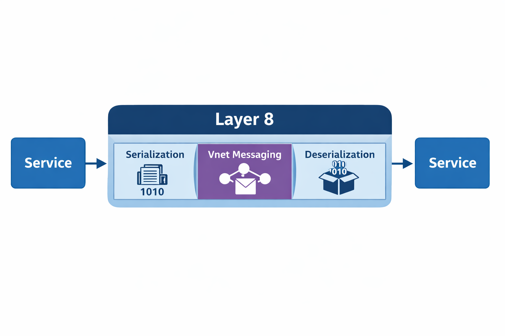

# <div align="center"> Serialization

---
## The Act of Serialization

When a process wants to share part of its in-memory state with another process, 
it must convert that state into a sequence of bytes and transmit it over the wire.
The receiving side must then reconstruct a usable representation from those bytes.

**This act is called serialization.**

In most systems, serialization is implemented directly inside application code:

- the provider explicitly converts a model into bytes,
- the consumer explicitly converts bytes back into a model.

As a result, application logic, transport concerns, and model evolution become tightly coupled.

---
## Serialization and Symmetry

Serialization always implies symmetry.
The sender and receiver must agree on the meaning and structure of the data being exchanged.
There is no such thing as serialization without symmetry.

The failure mode in distributed systems is not the existence of symmetry.
It is the fact that symmetry is enforced manually, repeatedly, and inconsistently across applications.

When every provider and consumer implements its own serialization and deserialization logic:

- model evolution must be coordinated across codebases,
- version mismatches surface at runtime,
- serialization bugs are duplicated across services,
- and application developers are burdened with infrastructure concerns.

Serialization and deserialization should be infrastructure-owned, not application-owned, 
because duplicating this logic across teams multiplies complexity, forces correlated code changes and 
delivery timelines, and turns model evolution into an organizational bottleneck rather than a 
platform concern.

--
## What Layer 8 Changes

Layer 8 does not attempt to weaken or avoid serialization symmetry.
Instead, it removes serialization and deserialization from application code entirely.

Both providers and consumers are decoupled from the model-to-bytes and bytes-to-model transformations.
Applications are responsible only for understanding and applying domain logic to models.

Understanding means that both the provider and the consumer know the model and agree on what each 
attribute represents and what its logical value means.
It does not include any responsibility for encoding or decoding bytes.

Serialization becomes a platform capability.

In Layer 8:

- the provider hands a model instance to the platform,
- the platform serializes it for transport,
- the receiving platform deserializes the payload,
- and the consumer receives a usable representation without performing any decoding logic.

This separation allows symmetry to be enforced centrally and consistently, rather than being 
hand-maintained in every service.

### Responsibility Boundary Diagram


*Figure: Service-to-service communication with serialization, messaging, and deserialization 
fully owned by Layer 8.*

This diagram makes responsibility boundaries explicit.
Applications never interact with bytes.
All model-to-bytes and bytes-to-model transformations are owned by Layer 8 and mediated through 
Vnet Messaging.

---
## Type Registry

Because serialization is no longer owned by either the provider or the consumer, 
Layer 8 requires an authoritative mechanism to resolve type identity and reconstruction.

**This is the role of the Type Registry.**

The Type Registry is authoritative over:

- type identity carried on the wire,
- the mapping between type identifiers and model definitions,
- serializer and deserializer selection,
- and the rules required to reconstruct models independently of application code.

The registry allows Layer 8 to deserialize payloads even when the consuming application did not compile 
against the concrete model type.

Deserialization produces a model instance or a model-agnostic representation that can be routed, 
inspected, stored, forwarded, or later bound to domain logic.

Understanding the model is optional and occurs only when the application needs to apply business behavior.

The mechanics that make this possible, including model-agnostic representations, runtime type resolution, 
and delta calculation, are explored in depth in the 
**Model-Agnostic Runtime: Data Without Schemas** chapter.

## JSON vs. Protocol Buffers

JSON is one of the most commonly used serialization formats today.
It is heavily used for communication with user interfaces and external systems.

Consider the following JSON example:

```
{
  "employees": [
    {
      "id": 101,
      "name": "Alice Johnson",
      "role": "Software Engineer",
      "department": "Platform"
    },
    {
      "id": 102,
      "name": "Bob Martinez",
      "role": "DevOps Engineer",
      "department": "Infrastructure"
    },
    {
      "id": 103,
      "name": "Carol Lee",
      "role": "Product Manager",
      "department": "Product"
    }
  ]
}
```

Beyond the raw data itself, JSON carries significant structural overhead.
Field names and delimiters are repeated throughout the message, increasing payload size and CPU cost.

Protocol Buffers take a different approach.
When both sides already know the order and meaning of fields, the wire format does not need to repeatedly 
encode labels.

Illustratively (this is not the exact wire format), the same data could look like this:

```
101Alice JohnsonSoftware EngineerPlatform102Bob MartinezDevOps EngineerInfrastructure103Carol LeeProduct ManagerProduct
```

## Protobuf Object - Delta Updates

In real systems, models are complex and deeply nested.
They change frequently, but rarely in their entirety.

Traditional serializers retransmit full objects even when only a small subset of fields has changed.

This is not merely an inefficiency.
It has direct economic consequences.

### Economic Impact of Full-Object Updates

Full-object retransmission increases cost along three dimensions:

- **Bandwidth**: unnecessary bytes consume network capacity and increase egress costs.
- **CPU**: repeated serialization and deserialization of unchanged data wastes compute cycles.
- **Coordination**: large payloads amplify the impact of schema changes, increasing the risk and cost of evolution.

Because serialization and deserialization are owned by the platform rather than individual applications, 
Layer 8 can address these costs structurally, instead of forcing every team to re-implement optimization 
logic or coordinate schema changes across services.

Layer 8 introduces the concept of the **Protobuf Object** to address this structurally.

A Protobuf Object is a serializer that understands how to:

- serialize any model instance or attribute,
- calculate changes between versions,
- and transmit only the delta.

### Why Deltas Matter

Delta-based updates reduce bandwidth by transmitting only what changed.
They reduce CPU usage by avoiding repeated processing of unchanged fields.

More importantly, they reduce coordination cost.
When only changes cross service boundaries, model evolution becomes localized.
Small changes remain small.

This shifts the economics of distributed systems:

- bandwidth scales with change, not model size,
- CPU cost scales with mutation, not state,
- and schema evolution no longer requires synchronized, system-wide agreement.

By avoiding full-object retransmission, Layer 8 limits the blast radius of change and improves both 
technical scalability and organizational velocity.

The mechanics of model-delta calculation are discussed in the 
**Model-Agnostic Runtime: Data Without Schemas** chapter.

---
## Elements

Service interactions vary widely.
Some operations return a single result.
Others return collections, streams, or errors.

Handling these variations typically leads to fragmented APIs and special-case logic.

Layer 8 introduces the concept of **Elements** to normalize these interactions.

Elements provide a consistent envelope for requests and responses, independent of cardinality or operation 
type. They allow consumers to reason about interactions uniformly, while Layer 8 handles serialization, 
transport, and reconstruction.

Centralizing serialization and deserialization in Layer 8 establishes a foundation for controlled runtime 
evolution, efficient delta-based updates, and uniform service interactions.
By removing serialization mechanics from application code, Layer 8 enables models to evolve without 
coordinated redeployments, limits the cost and blast radius of change through deltas, and provides a 
consistent envelope for APIs via Elements. Together, these properties shift distributed systems from 
fragile, coordination-heavy designs to architectures where change is expected, bounded, and economically 
sustainable.

Elements play a central role in Layer 8 APIs and are explored further in the 
**API & Query Language** chapter.